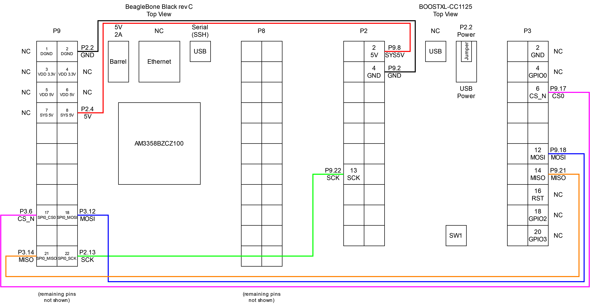

# rxlogger

This directory contains test files and configuration scripts for the BeagleBone Black rev C (abbreviated as BBB). The rxlogger program will be run on the Sensor Manager, which is the gateway between the traditional IoT tags and the greenhouse controls system.


The BBB (running rxlogger) receives periodic (1/second) 4-byte data packets from the MSP430FR5969 IoT tag which contains device ID, temperature, and humidity. The BBB parses the packet to recover the temperature and humidity and updates its Modbus registers for the tag. The BBB also logs a time-stamped CSV of successfully parsed packets.

## Files
- unused\ -- Folder containing unused files
- cc112x_easy_link_reg_config.h -- CC1125 registers. Modify the fields CC112X_PKT_CFG0 and CC112X_PKT_LEN according to fixed/variable packet length mode. Currently on ETSI CAT 1 at 869 MHz.
- cc112x_spi.c -- C source file for CC1125 register-level SPI access.
- cc112x_spi.h -- C header file for CC1125 register-level SPI access.
- hal_spi_rf_trxeb.c -- C source file for CC1125 byte-level SPI access.
- hal_spi_rf_trxeb.h -- C header file for CC1125 byte-level SPI access.
- main.c -- C source file that implements the program described in the introduction. Most customizations are done by modifying the defines at the top of this file.
- out -- Executable file that runs the program described in `main.c`.
- README.md -- This file.
- SPI.c -- C source file for the SPI library. Direct SPI peripheral manipulation.
- SPI.h -- C header file for the SPI library. Direct SPI peripheral manipulation.
- SystemDiagram.png -- System diagram.
- Wiring.png -- Wiring diagram.

## SPI Access Hierarchy
main --> cc112x_spi.c/h --> hal_spi_rf_trxeb.c/h --> SPI.c/h --> spidev.h
1. Main makes register-level calls through `cc112x_spi.h`.
2. `cc1125x_spi.h` makes byte-level calls through `hal_spi_rf_trxeb.h` in order to make the appropriate number of transfers for the desired register access or command strobe.
3. `hal_spi_rf_trxeb.h` makes the direct-access SPI call (`ioctl`) through `SPI.h`.

## Prerequisites
You must have libmodbus installed, ideally built from source from https://github.com/stephane/libmodbus. You may need to either restart the BeagleBone Black, refresh/reload libraries with `ldconfig`, or modify the path if the library is not on the path and fails to include. The SPI pins must be configured as SPI using the `config-pin-spi0-on.sh` script.

TODO: Test if the debian packages `libmodbus5` or `libmodbus-dev` are compatible with rxlogger. Check for issues with `modbus_get_indication_timeout()`.

You must have the following hardware:
- [BeagleBone Black](https://www.beagleboard.org/boards/beaglebone-black) revision C (other revisions may also work)
- USB to RS485 cable (FTDI: [USB-RS485-WE-1800-BT](https://ftdichip.com/products/usb-rs485-we-1800-bt/))
- CC1125 BoosterPack (Texas Instruments: [BOOSTXL-CC1125](https://www.ti.com/tool/BOOSTXL-CC1125))
    - You can also use the standalone CC1125 chip, but you will need to set up a breakout board / PCB and antenna yourself. The TI design files may be a good starting point https://www.ti.com/lit/zip/swrc322.

## Wiring Diagram


## Instructions
Compilation is done with the following command:
```
gcc *.c *.h -o rxlogger -lmodbus
```
And execute. Not sure if sudo is required.
```
sudo ./rxlogger
```

## Customization and Tuning
Use Texas Instruments' [SmartRF Studio 7](https://www.ti.com/tool/download/SMARTRF-STUDIO-7) and the CC1125 BoosterPack to determine the optimal register settings for your desired frequency and modulation. Then, replace the `cc112x_easy_link_reg_config.h` file with the newly exported registers from SmartRF Studio 7 (export as value line or performance line preset).

You can choose a different SPI peripheral to use by modifying the define for `SPI_DEVICE` in main.

If the USB device for the RS485 FTDI cable is incorrect, use the command `lsusb` to list usb devices to check if the FTDI cable is connected. Use the command `dmesg` to figure out which `\dev\ttyUSBx` (where x is a number) the FTDI cable is accessible through. Modify the define for `RTU_PORT` accordingly.

## Attribution
SPI library is based on resources provided in Dr. Brian Fraser's CMPT433 course: https://opencoursehub.cs.sfu.ca/bfraser/grav-cms/cmpt433/links

Specifically, this guide developed by Ian Cruikshank: https://opencoursehub.cs.sfu.ca/bfraser/grav-cms/cmpt433/links/files/2022-student-howtos-ensc351/SPI-On-BBG.pdf

And its support files: https://opencoursehub.cs.sfu.ca/bfraser/solutions/433/StudentHowToGuides/2022Files-Ensc351/SPI-On-BBG.zip

Which is itself based on code from Derek Molloy: https://github.com/derekmolloy/exploringBB/blob/version2/chp08/spi/spidev_test/spidev_test.c
